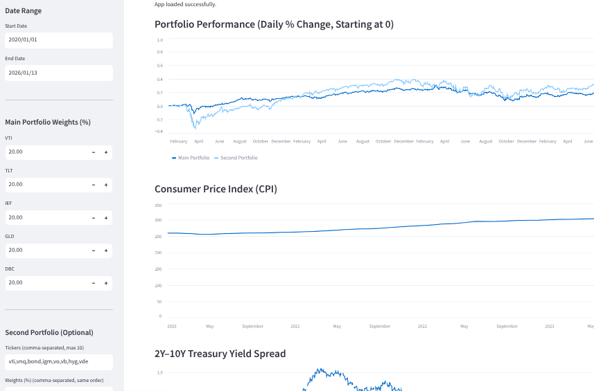

# AllWeatherPortfolio – Learning Project

This repository documents my learning journey building a cloud-hosted financial web application using:

- Python & Streamlit  
- Docker containers  
- GitHub Actions CI/CD  
- Azure App Service + Azure Container Registry  
- FRED economic data API  
- yfinance market data

The goal was **not** to build a production investment tool, but to learn how modern cloud components interact end-to-end.

---

## What This App Demonstrates

- Building a Streamlit web UI for portfolio analysis  
- Calculating portfolio performance from user-selected weights  
- Overlaying macro indicators (CPI and 2y10y Treasury spread)  
- Containerizing a Python app with Docker  
- Automated deployment from GitHub to Azure  
- Secure handling of API keys using environment variables  
- Debugging ports, CORS, and Azure configuration issues

---

## Architecture Overview

User Browser
│
Azure App Service (Container)
│
Docker Image from ACR
│
Streamlit App (Python)
│
┌───────────────┬─────────────────┐
│ yfinance API │ FRED API │
└───────────────┴─────────────────┘

markdown
Copy code

**CI/CD Flow**

1. Code edited locally  
2. Commit pushed to GitHub  
3. GitHub Actions builds Docker image  
4. Image pushed to Azure Container Registry  
5. Azure App Service pulls latest image  
6. App restarts with new version

---

## Security Notes

- All secrets (FRED API key, Azure credentials, connection strings) were **removed from git history** before this repo was made public  
- The app expects secrets to be provided via:

  - GitHub Secrets (for build pipeline)  
  - Azure App Service → Application Settings

Example expected variable:

FRED_API_KEY=your_key_here

yaml
Copy code

No credentials are stored in this repository.

---
## Application Screenshot



## How to Run Locally

1. Clone the repo

```bash
git clone https://github.com/<your-user>/AllWeatherPortfolio.git
cd AllWeatherPortfolio
Create virtual environment

bash
Copy code
python -m venv venv
source venv/bin/activate
pip install -r requirements.txt
Set environment variable

bash
Copy code
export FRED_API_KEY="your_key"
Run Streamlit

bash
Copy code
streamlit run all_weather_app.py
Docker Build
bash
Copy code
docker build -t allweather .
docker run -p 8000:8000 allweather
App will be available at:

arduino
Copy code
http://localhost:

Lessons Learned
Azure often expects apps on certain ports
Streamlit CORS/XSRF settings conflict by default
GitHub Actions is extremely sensitive to Dockerfile syntax
Environment variables are safer than embedding keys
“Application Error” in Azure usually means:
wrong port
container crash
missing dependency

Possible Future Enhancements
Business-cycle regime model
Additional macro indicators
User accounts

Disclaimer
This project is for educational purposes only and is not investment advice.
Market data is pulled from public APIs without validation for trading use.

Author
Built as a personal learning project to develop skills in:

Cloud architecture
DevOps workflows
Python financial analysis
Secure secret management
Modern web app deployment


